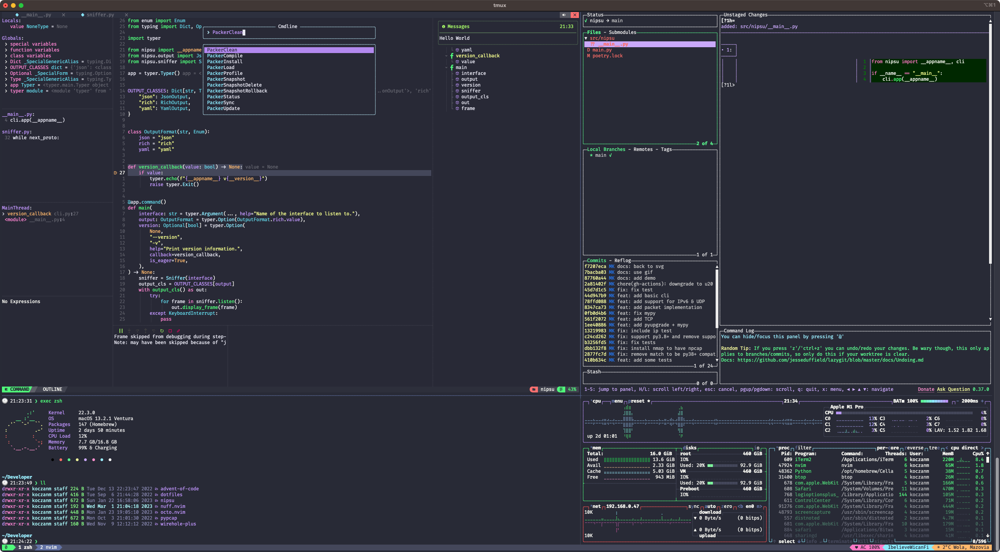

# Koczanm's dotfiles

## Installation

*Warning*: If you want to give these dotfiles a try, you should first fork this repository, review the code, and remove
things you don't want or need. Don't blindly use my settings unless you know what that entails. USE AT YOUR OWN RISK!

To install these dotfiles run:
```
/bin/bash -c "$(curl -fsSL https://raw.githubusercontent.com/koczanm/dotfiles/HEAD/install.sh)"
```

## Showcase


